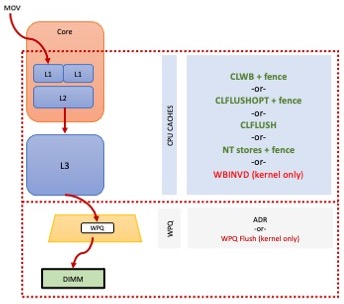
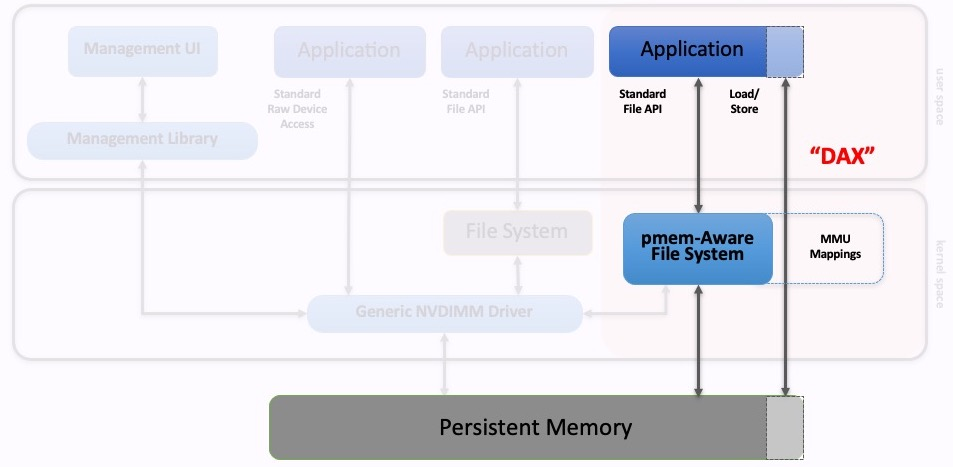
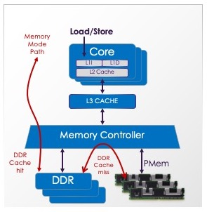
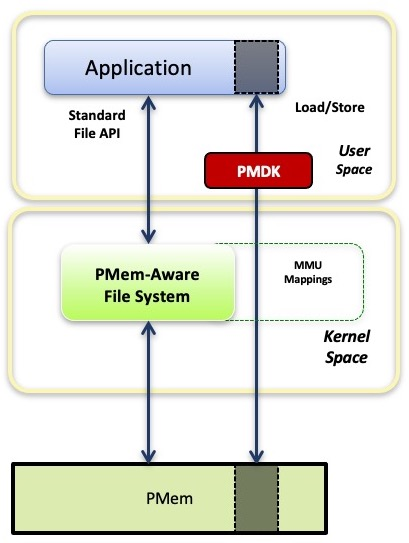
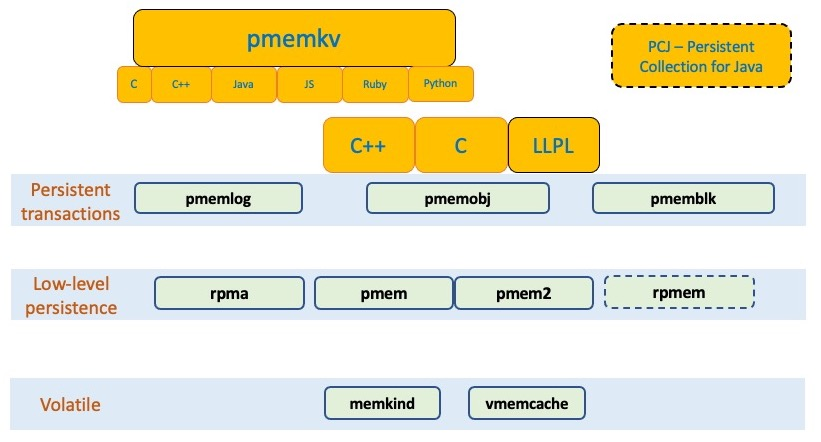
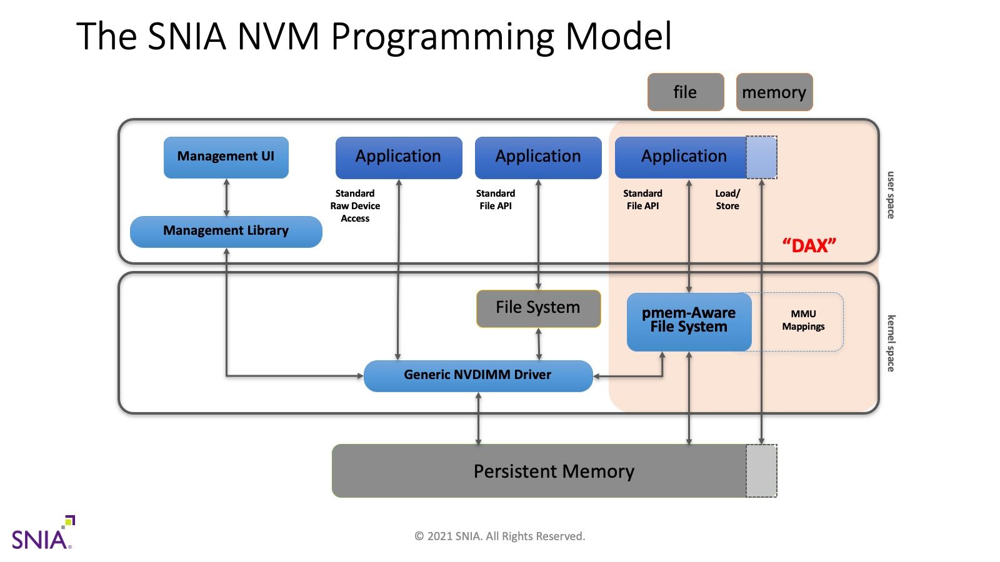
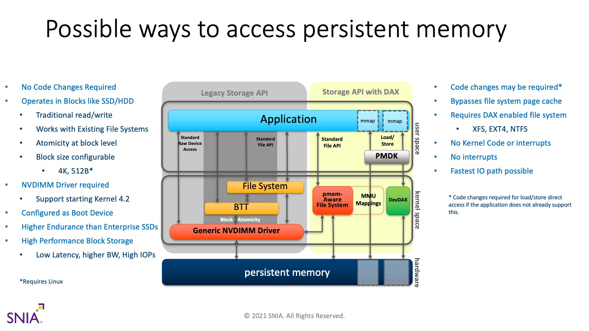

#### Glossary of Terms

Here you'll find a list of terms related to
[Persistent Memory](#persistent-memory) (PMem).
Many of these terms have a broader meaning,
but the definitions below focus specifically
on their relationship to PMem.

Click on the term to go to the definition in this page,
or scroll down to read them all.  Related terms are
shown in parentheses.

<table style="font-size: .75em; border: 2px; padding: 1em;">
<tr><td>
Compute Express Link™ and CXL™ are trademarks of the
<a href="https://computeexpresslink.org">CXL Consortium</a>.
Intel® and Intel® Optane™ are trademarks of
<a href="https://intel.com">Intel Corporation</a>.
JEDEC® is a trademark of the
<a href="https://jedec.org">JEDEC Organization</a>.
SNIA® is a trademark of the
<a href="https://snia.org">Storage Networking Industry Association</a>.
</td></tr></table>

##### Contents
<!-- begin toc -->

- [1LM](#1lm) (One-level Memory)
- [2LM](#2lm) (Two-level Memory)
- [3D XPoint](#3d-xpoint)
- [ADR](#adr) (Asychronous DRAM Refresh)
- [App Direct](#app-direct) (Application Direct)
- [ARS](#ars) (Address Range Scrub)
- [Bad Blocks](#bad-blocks)
- [Blast Radius](#blast-radius)
- [Block Storage](#block-storage) (Storage, Disk)
- [BTT](#btt) (Block Translation Table)
- [CLFLUSHOPT](#clflushopt) (Instruction: Cache Line Flush, Optimized)
- [CLWB](#clwb) (Instruction: Cache Line Write Back)
- [CXL](#cxl) (Compute Express Link)
- [DAX](#dax) (Direct Access)
- [DDR](#ddr) (Double Data Rate)
- [DDR-T](#ddr-t)
- [Device DAX](#device-dax) (devdax)
- [Dirty Shutdown Count](#dirty-shutdown-count) (DSC, Unsafe Shutdown Count)
- [DRAM](#dram) (Dynamic Random Access Memory)
- [DSM](#dsm) (Device Specific Method, \_DSM)
- [eADR](#eadr) (Extended ADR)
- [Fence](#fence) (SFENCE)
- [FlushViewOfFile](#flushviewoffile) (Windows Flush System Call)
- [Interleave Set](#interleave-set)
- [KMEM DAX](#kmem-dax)
- [Label Storage Area](#label-storage-area) (LSA)
- [libmemkind](#libmemkind)
- [libpmem](#libpmem)
- [libpmem2](#libpmem2)
- [libpmemblk](#libpmemblk)
- [libpmemkv](#libpmemkv)
- [libpmemlog](#libpmemlog)
- [libpmemobj](#libpmemobj)
- [librpma](#librpma)
- [LLPL](#llpl) (Java Low Level Persistence Library)
- [MapViewOfFile](#mapviewoffile) (Windows Memory Map System Call)
- [Memory Mode](#memory-mode) (2LM)
- [mmap](#mmap) (POSIX Memory Map System Call)
- [msync](#msync) (POSIX Flush System Call)
- [Namespace](#namespace)
- [ndctl](#ndctl)
- [NFIT](#nfit) (NVDIMM Firmware Interface Table)
- [NT Store](#nt-store) (Non-Temporal Store)
- [NVDIMM](#nvdimm) (Non-Volatile Dual In-line Memory Module)
- [NVM](#nvm) (Non-Volatile Memory)
- [Optane](#optane) (DCPMM, DCPM)
- [Paging](#paging)
- [PCJ](#pcj) (Persistent Collections for Java)
- [Persistence Domain](#persistence-domain) (Power Fail Safe Domain)
- [Persistent Memory](#persistent-memory) (PMem, pmem, PM)
- [PMDK](#pmdk) (Persistent Memory Development Kit)
- [PMem Programming Model](#pmem-programming-model)
- [pmemhackathon](#pmemhackathon) (Persistent Memory Programming Workshop)
- [PMoF](#pmof) (Persistent Memory over Fabrics)
- [Poison](#poison)
- [Pool](#pool)
- [Poolset](#poolset)
- [Programming Model](#programming-model)
- [Region](#region)
- [RPMEM](#rpmem) (Remote Persistent Memory)
- [SNIA](#snia) (Storage Networking Industry Association)
- [Storage Class Memory](#storage-class-memory) (SCM)
- [Transaction](#transaction)
- [Uncorrectable Error](#uncorrectable-error)

<!-- end toc -->

 

<!-- begin glossary -->

#### 1LM

(One-level Memory)

The term **1LM** refers to how memory is usually connected to
the system, without any memory-side cache.  Normally, the
terms **DRAM** or **system main memory** are used, but **1LM** is
sometimes used to specifically state that the memory in question
is not configured as [2LM](#2lm).

[Back to top](#contents)
   
#### 2LM

(Two-level Memory)

Persistent memory is sometimes configured as **2LM** where hardware
manages two levels (tiers) of memory.  This is a feature of the
[Intel's Optane PMem](#optane), which calls this configuration
[Memory Mode](#memory-mode) (more detail in that glossary entry).

[Back to top](#contents)
   
#### 3D XPoint
3D XPoint (pronounced _three dee cross point_) is the media used in
[Intel's Optane](#optane) product line, where the media is organized
into Solid State Disk (SSD) products, and Persistent Memory (PMem)
products.  More details can be found on
[Intel's website](http://intel.com/optane).  There is also a fairly
extensive [Wikipedia](https://en.wikipedia.org/wiki/3D_XPoint) entry
for it.

|  |
|:--:|
| *3D XPoint* |

[Back to top](#contents)
   
#### ADR

(Asychronous DRAM Refresh)

**ADR** is the hardware feature that flushes stores from the memory
controller write pending queue (WPQ) to their destination on power loss.
ADR can optionally flush
pending DMA stores from the I/O controller as well.

As shown in the above diagram, there are multiple places a store could
reside on its way to a persistent memory DIMM.  The lower dashed red box
shows the ADR domain -- stores that reach that domain are protected against
power failure by ADR, which flushes the queues in the memory controller, shown
as the trapezoid in the diagram.  All Intel systems supporting persistent
memory require ADR, which means the feature must be supported at the platform
level (including CPU, motherboard, power supply, DIMM, and BIOS).  All
[NVDIMM-N](#nvdimm) products, as well as Intel's [Optane](#optane) PMem,
require systems that support ADR.

ADR uses stored energy to perform the flushes after power loss.  The stored
energy typically comes from capacitors in the power supply, but could be
implemented other ways such as a battery or UPS.

The larger red dashed box in the diagram illustrates an optional feature,
[eADR](#eadr), where the CPU caches are also flushed on power loss.

[Back to top](#contents)
   
#### App Direct

(Application Direct)

[Intel's Optane PMem](#optane) product can be provisioned into
two modes: **App Direct** and [Memory Mode](#memory-mode).  See
[Intel's website](http://intel.com/optane) for product details.
The App Direct mode provides the
[persistent memory programming model](#programming-model).

When configured this way, the OS can provide direct access or [DAX](#dax)
to persistent memory aware applications.  This allows applications to
access the persistence just like memory, with loads and stores.

[Back to top](#contents)
   
#### ARS

(Address Range Scrub)

[NVDIMM](#nvdimm) products may provide an interface that allows the
operating system
to discover the known poison locations on the device.
Knowing about these [bad blocks](#bad-blocks)
ahead of time allows applications
to avoid consuming poison, thereby avoiding the associated exception
that typically kills the application.

The ARS interface is exposed as a [DSM](#dsm).
The DSM for Address Range Scrub is
described by the ACPI specification, available on the
[UEFI web site](https://uefi.org/).

[Back to top](#contents)
   
#### Bad Blocks
The OS may track a list of known **bad blocks** on a persistent
memory device.  These blocks may be discovered using the Address
Range Scan ([ARS](#ars)) operation supported by some NVDIMMs,
or they may be discovered on the fly when software tries to use
a location and is returned poison instead.

For normal volatile memory (i.e. DRAM) on a server class machine,
an uncorrectable error will result in a _poison_ value returned
to the application that consumes it.
On Intel platforms,
consuming poison causes a _machine check_ which, in turn, will cause
the kernel to send an exception to the process consuming the poison.
On Linux, the exception takes the form of a SIGBUS signal, and most
applications will die as a result.  On restart, the problem is gone
since the application starts allocating volatile memory from scratch
and the OS will have sequestered the page containing the poison.

Persistent memory adds complexity to this case.  Poison consumption
results in the same SIGBUS in the Linux example above, but if the application
dies and restarts it is likely to return to reading the same location
since there's an expectation of persistence -- the OS can't just replace
the old page with a new one like it can for volatile memory since it
needs the poison to remain there to indicate the loss of data.

ECC information, which is used to detect uncorrectable errors,
is typically maintained for each cache line, which
on an Intel system is 64-bytes.  But that small range can be rounded
up to a larger range due to the [blast radius](#blast-radius) effect.

To prevent the ugly behavior where a PMem-aware application repeatedly
starts up, consumes poison, and dies, the OS provides a way for the
application to access the list of known bad blocks.  On Linux, the
**ndctl** command can be used to view this information as well:

`# ndctl list --media-errors`

An API provided by **libndctl** allows applications to access this
information directly, and the PMDK libraries use that API to prevent
opening a PMem pool when it contains known bad blocks.  The common
action taken by an application in this case is to refuse to continue,
forcing the system administrator to restore the pool data from a
backup or redundant copy.  Of course it is possible for the application
to attempt to repair the pool directly, but that leads to much more
complex application logic.

[Intel's PMem RAS page](https://software.intel.com/content/www/us/en/develop/articles/pmem-RAS.html)
contains more information on this topic, focused on the Optane PMem product.

[Back to top](#contents)
   
#### Blast Radius
When a location of [persistent memory](#persistent-memory) experiences
an uncorrectable error, that data is lost.  Memory on Intel platforms
is accessed as 64-byte cache lines, but there are cases where losing a
single location can cause an application to lose a larger block of data.
This is known as the **blast radius** effect.

As shown in the above diagram, a 64-byte location containing poison
(due to an uncorrectable error, for example), may get its size rounded
up by the device to whatever that device uses as its _ECC block size_.
The Linux operating system can learn about these bad locations via
the [address range scrub](#ars) mechanism.  Linux tracks these areas
using a [bad block](#bad-blocks) tracking data structure in the kernel
that tracks 512-byte blocks, so the size will be rounded up to 512-bytes
by that.  If the application memory maps the file, the OS will map
an invalid page at that location, again rounding the size up to the
larger value of 4096-byte (the page size on Intel systems).

[Back to top](#contents)
   
#### Block Storage

(Storage, Disk)

When comparing traditional storage to persistent memory, these are the primary
differences:

- The interface to block storage is block-based.  Software can only read a
block or write a block.  File systems are typically used to abstract away
this detail by [paging](#paging) blocks to/from storage as required.

- The interface to PMem is byte-addressable.  Software can read or write
any data size without the need for paging.  Persistent data are accessed
in-place, reducing the need for DRAM to hold buffered data.

- When a use case does want to move a block, such as 4k of data, block
storage devices like NVMe SSDs initiate DMA to memory.  This allows the
CPU to perform other work while waiting for the data transfer.

- PMem is typically implemented as an [NVDIMM](#nvdimm),
connected to the memory bus,
which cannot initiate DMA.  To move 4k of data, the CPU usually moves
the data, which is lower latency than a storage device but results in
higher CPU utilization.  One potential solution to this is to use a
DMA engine if the platform provides one.

- PMem can emulate a block storage device and in fact, that is part of the
[PMem programming model](#programming-model).  Block storage cannot emulate
PMem since it is fundamentally not byte-addressable.  Paging can get close
to emulating PMem, especially for fast SSDs, but flushing changes to
persistence will still require executing kernel code with block storage,
where PMem can flush to persistence directly from user space (see [ADR](#adr)
and [eADR](#eadr) for details).

Also see [BTT](#btt) for details on how PMem emulates block storage.

[Back to top](#contents)
   
#### BTT

(Block Translation Table)

The **BTT** algorithm provides single block powerfail write atomicity
on top of persistent memory.  This allows PMem to emulate storage and
provide similar semantics to NVMe.
NVMe storage requires at least
one block powerfail write atomicity, meaning a block being written
during a power failure will either be fully written or not written at
all.  Since software may depend on this attribute of storage, the BTT
algorithm was designed to implement the same semantics in software.  The
algorithm was standardized as part of [UEFI](https://uefi.org).

For an introduction on how BTT works, shorter than reading the full
specification, see [this blog](https://pmem.io/2014/09/23/btt.html),
written by the Linux maintainer of its BTT implementation, Vishal Verma.

[Back to top](#contents)
   
#### CLFLUSHOPT

(Instruction: Cache Line Flush, Optimized)

The Intel instruction set has long contained a cache flush
instruction, CLFLUSH, which will evict a specific cache line
from the CPU caches.  The definition of CLFLUSH, which pre-dates
[persistent memory](#persistent-memory), includes a [fence](#fence)
as part of the instruction.  This means that a loop of CLFLUSH
instructions, intended to flush a range
of cache lines, will be serialized due to the fence between each
flush.

With the advent of persistent memory, Intel introduced
the **CLFLUSHOPT** instruction, which is optimized by removing
the embedded fence operation.  As a result, a loop of CLFLUSHOPT
instructions will launch the flushes, allowing for some parallelism
of the flushes.  Such a loop should be terminated with a final
[fence](#fence) to ensure completion before software continues under
the assumption that the stores in that range are persistent.

The CLFLUSHOPT instruction always evicts the cache line, meaning
the next access to that address will be a CPU cache miss, even if it
happens very soon after the flush.  Compare this with the [CLWB](#clwb)
instruction, which allows the line to remain valid.

[Back to top](#contents)
   
#### CLWB

(Instruction: Cache Line Write Back)

The **CLWB** instruction is the preferred way to flush
PMem stores to persistence, when required by the platform.
This is the case for platforms that only support [ADR](#adr).
Platforms that support [eADR](#eadr) allow software to skip
the CLWB instructions for better performance.

Unlike the CLFLUSH and [CLFLUSHOPT](#clflushopt) instructions,
CLWB tells the CPU it is desirable to leave the cache line
valid in the CPU cache after writing our any dirty data.  This
provides better performance for the cases where the application
accesses the line again, soon after flushing.

Like [CLFLUSHOPT](#clflushopt), the CLWB instruction does not
contain an implied [fence](#fence), so after flushing a range
using this instruction, it is typical to issue an SFENCE instruction.

[Back to top](#contents)
   
#### CXL

(Compute Express Link)

Quoting from the [CXL web site](https://www.computeexpresslink.org/),
Compute Express Link™ (CXL™) is an industry-supported
Cache-Coherent Interconnect for Processors, Memory Expansion and Accelerators.

For [persistent memory](#persistent-memory), CXL offers a new attach point.
The CXL 2.0 specification, published in November 2020, includes the necessary
support for PMem, including changes for management, configuration,
namespace and regions labels, and a flush-on-fail mechanism similar to
[eADR](#eadr) (called GPF for Global Persistent Flush in CXL terminology).

For PMem-aware application programmers, the most important aspect of CXL is
that the [PMem programming model](#programming-model) remains unchanged.
A program written for an NVDIMM-based PMem product will work without
modification on a CXL-based PMem product.

The _2021 PM+CS Summit_ (April 22, 2021) contained this talk which
provides a brief overview of the changes made to CXL in support of PMem.

[Back to top](#contents)
   
#### DAX

(Direct Access)

The [PMem programming model](#programming-model) states that applications
can directly map persistent memory using the standard memory mapped files API
provided by the OS.  This feature, where system calls like
[mmap](#mmap) and [MapViewOfFile](#mapviewoffile) bypass the page cache,
has been named **DAX** in both Linux and Windows.  DAX is short for
_direct access_ and is a key feature added to the operating systems
in support of persistent memory.

As shown in the above diagram, an application uses standard APIs to
open a file and then memory map it.  The job of the PMem-aware file system
is to provide the DAX mapping, so that no [paging](#paging) occurs
as the application accesses the memory range.

In order to make stores to PMem persistent, the standard API for flushing
may be used: ([msync](#msync) on Linux, or [FlushViewOfFile](#flushviewoffile)
on Windows).  The programming model also allows for user space flushing
to persistence directly using instructions like [CLWB](#clwb), but this is
only allowed on Linux if `mmap` is successfully called with the `MAP_SYNC`
flag.  On Windows, all DAX mappings allow flushing from user space.

The [Linux doc on DAX](https://www.kernel.org/doc/Documentation/filesystems/dax.txt)
contains additional information about DAX on Linux.

[Back to top](#contents)
   
#### DDR

(Double Data Rate)

The term **DDR** is a generalization of the various versions of
the DDR protocol.  For example, DDR4 is explained
[here on Wikipedia](https://en.wikipedia.org/wiki/DDR4_SDRAM).

When talking about persistent memory, this term is used to talk about
what types of memory are plugged into what types of sockets.  For example,
NVDIMM-N products typically plug into DDR sockets, like normal DRAM.
Intel's Optane PMem plugs into DDR sockets but runs the [DDR-T](#ddrt)
protocol over the DDR electricals.

[Back to top](#contents)
   
#### DDR-T
**DDR-T** is the protocol used on Intel platforms with their
[Optane](#optane) PMem products, which plug into the system's [DDR](#ddr) slots.

[Back to top](#contents)
   
#### Device DAX

(devdax)

Linux supports [DAX](#dax), which allows a PMem-aware file system to
give applications _direct access_ to PMem when they memory map a file.
Linux also supports DAX without using a file system via a configuration
known as **device DAX**.  The Linux `ndctl` command uses the terms
`fsdax` and `devdax` to choose between these two types of DAX, as
described in the
[ndctl-create-namespace](https://pmem.io/ndctl/ndctl-create-namespace.html)
man page.

In most cases, the ability to manage PMem like files, including naming,
permissions, and POSIX file APIs, makes fsdax the preferred choice.  devdax
does not follow the [PMem programming model](#programming-model) since
the normal file APIs do not work with it.  Here are the main differences
between fsdax and devdax on Linux:

- In both cases, fsdax and devdax, the normal I/O path is load
and store instructions which allow access directly from user space, with no
kernel code in the data path.

- devdax exposes the entire namespace as a single device, since there's
no file system to divide the space into named files.

- The lack of file system also means the lack of file permissions, so devdax
requires either running the application as root, or changing permissions
on the device itself.

- devdax provides more raw access to the PMem, so it is easier for an
application to guarantee alignment for large pages.  This is the most common
reason for an application to use devdax, as described by RedHat
in [this page](https://access.redhat.com/documentation/en-us/red_hat_enterprise_linux/7/html/storage_administration_guide/configuring-persistent-memory-for-use-in-device-dax-mode).

- When the system knows about [bad blocks](#bad-blocks) in PMem, fsdax will
map invalid pages in those areas to prevent applications from consuming
poison.  Consuming poison on Intel servers causes _machine checks_ which
can be difficult to deal with.  devdax access is more raw, allowing pages
containing poison to be mapped so applications will experience machine checks
when they touch those areas, even if the poison is already known to the system.

- devdax allows long-lived RDMA memory registrations, like those required
by some RDMA-based libraries.  This is the next most common reason for an
application to use device DAX.  With fsdax, long-lived memory
registrations are disallowed, and only RDMA cards that support _On-Demand Paging_
(ODP) will work.

- devdax does not implement all of POSIX.  For example, [msync](#msync)
does not work and user space flushing with instructions like [CLWB](#clwb)
must be used instead.  Finding the size of the PMem is more complex than
just calling `stat(2)`, but the [PMDK](#pmdk) libraries abstract away these
differences and work with devdax as expected.

- Since devdax does not include a file system, the usual security
provided by a file system, where allocated blocks are zeroed, is not
provided.  This means applications can see old data left there from
previous runs so the application designer must take this into account.

PMDK provides a utility, [daxio](https://pmem.io/pmdk/manpages/linux/v1.10/daxio/daxio.1.html)
for saving/restoring/zeroing a devdax device.

[Back to top](#contents)
   
#### Dirty Shutdown Count

(DSC, Unsafe Shutdown Count)

Flush-on-fail mechanisms like [ADR](#adr) and [eADR](#adr) provide
a [programming model](#programming-model) for PMem by transparently
ensuring stores reach persistence even in the face of sudden power loss.
When the flush-on-fail mechanism itself fails, the promise made to
software no longer holds true and some unflushed stores may have been
lost.  This is a rare occurrence, typically the result of a hardware
fault, but obviously it must be reported to software to avoid silent
data corruption.  The **dirty shutdown count** is the way this failure
is reported to software.

When a PMem-aware application starts using a PMem file, it looks up
the current dirty shutdown count and stores it in the header information
for that file.  Each time the file is opened, the current count is checked
against the stored count to see if a dirty shutdown has happened.  If one
has happened, the application should consider the file in an unknown state.
Applications may attempt to repair the file, but the most common action is
to consider the file lost and to restore it from a redundant source such as
a back up copy.

The [PMDK](#pmdk) libraries store and check the dirty shutdown count as
described above and will refuse to open any pools that fail the check.

[Back to top](#contents)
   
#### DRAM

(Dynamic Random Access Memory)

**DRAM** is the traditional main memory connected to virtually all
computers today.

[Persistent memory](#persistent-memory) can be
made out of DRAM, which is exactly what the NVDIMM-N products
on the market do.  With NVDIMM-N, the PMem runs at DRAM speeds
because it is actually DRAM, and when power is lost, the NVDIMM-N
saves the data persistently on a NAND flash chip.

[Persistent memory](#persistent-memory) can be
made out of other media types which are not DRAM.  Intel's
[Optane](#optane) PMem uses [3D XPoint](#3d-xpoint) as its
media, for example.

The comparison between NVDIMM-N and Intel's Optane points out
that whether or not a product is considered PMem is more
about the [programming model](#programming-model) it provides,
rather than which media type it uses to implement that model.

[Back to top](#contents)
   
#### DSM

(Device Specific Method, \_DSM)

ACPI defines the notion of a Device Specific Method, often written as **_DSM**,
which allows the pre-boot environment to abstract away some hardware details
and provide a uniform interface for the OS to call.
The standard DSMs for NVDIMMs are
described by the ACPI specification, available on the
[UEFI web site](https://uefi.org/).
In addition, Intel has published the [DSM Interface for Optane](https://pmem.io/documents/IntelOptanePMem_DSM_Interface-V2.0.pdf) (pdf).

[Back to top](#contents)
   
#### eADR

(Extended ADR)

**eADR** is the hardware feature that flushes stores from the
CPU caches and memory
controller write pending queues (WPQ) to their destination on power loss.

As shown in the above diagram, there are multiple places a store could
reside on its way to a persistent memory DIMM.  The lower dashed red box
shows the ADR domain -- stores that reach that domain are protected against
power failure by [ADR](#adr),
which flushes the queues in the memory controller, shown
as the trapezoid in the diagram.  All Intel systems supporting persistent
memory require ADR.  The larger red dashed box in the diagram illustrates
an optional platform feature, **eADR**,
where the CPU caches are also flushed.

eADR uses stored energy to perform the flushes after power loss.

The BIOS notifies the OS that CPU caches are considered persistent using
a field in the [NFIT](#nfit) table.  In turn, the OS typically provides
an interface for applications to discover whether they need to use
cache flush instructions like [CLWB](#clwb) or whether they can depend
on the automatic flush on power failure provided by eADR.  Using
[PMDK](#pmdk) will allow an application to check for eADR automatically
and skip cache flush instructions as appropriate.

[Back to top](#contents)
   
#### Fence

(SFENCE)

The term **fence** refers to ordering instructions that programmers typically
use to order operations to memory.  For the Intel architecture, the intricate
details of the fence instructions are described in the
[Software Development Manuals](http://intel.com/sdm) (SDM).
For [persistent memory](#persistent-memory) programming, the _SFENCE_
instruction is particularly interesting.  The ordering properties of
SFENCE are described by Intel's SDM as follows:

>The processor ensures that every store prior to SFENCE is globally visible before any store after SFENCE becomes globally visible.

For systems with [eADR](#eadr), where global visibility means persistence,
the SFENCE instruction takes on a double meaning of making the stores both
visible to other threads and persistent.

For [ADR](#adr) systems, where cache flushing is required to make stores
persistent, it is necessary to ensure that flushed stores have been accepted
by the memory subsystem, so that they may be considered persistent.  Cache
flush instructions like [CLWB](#clwb) are _launched_ and run asynchronously.
Before software can continue under the assumption that the flushed range
is persistent, it must issue an SFENCE instruction.

Libraries like [PMDK](#pmdk) are designed to abstract away the details of
complex instructions like SFENCE, in order to make PMem programming easier
for application developers.

[Back to top](#contents)
   
#### FlushViewOfFile

(Windows Flush System Call)

One principle of the [PMem programming model](#programming-model)
is that standard file APIs work as expected on PMem files.  For
Windows, the standard API for memory mapping a file is
[MapViewOfFile](#mapviewoffile) and the standard way to flush
any stores to that range to make them persistent is **FlushViewOfFile**.

On Windows, when a PMem file is [DAX](#dax) mapped, it is also
possible to flush stores directly from user space using flush
instructions like [CLWB](#clwb).  This is typically much faster
than using the system calls for flushing, but both will work.

It is important to note that, according to [Microsoft's documentation](https://docs.microsoft.com/en-us/windows/win32/api/memoryapi/nf-memoryapi-flushviewoffile),
FlushViewOfFile may return before the flushing is complete, so
it is common to call _FlushFileBuffers_ after using FlushViewOfFile.

FlushViewOfFile on Windows is roughly equivalent to [msync](#msync) on POSIX
systems.

[Back to top](#contents)
   
#### Interleave Set
The [Interleaved Memory](https://en.wikipedia.org/wiki/Interleaved_memory) entry
on Wikipedia describes how interleaving is used for performance, similar to
striping across disks in a storage array.  For [persistent memory](#persistent-memory),
there's another consideration.  Since PMem is persistent, the interleave set must
be constructed the same way each time the PMem is configured by the system, or
else the persistent data will appear garbled to software.

Exactly how PMem interleave sets are created the same way each time is a
product specific detail for [NVDIMMs](#nvdimm).  For persistent memory on
[CXL](#cxl), a standard mechanism for this has been defined: _region labels_.
These labels are stored persistently in a
[label storage area](#label-storage-area),
also defined by the CXL specification.

An interleave set is also called a [region](#region) by Linux, as well as by
the CXL specification.

[Back to top](#contents)
   
#### KMEM DAX

For a volatile use of persistent memory, there is an alternative for [Memory Mode](#memory-mode).
[Device DAX](#device-dax) can be configured in [system-ram mode](https://pmem.io/ndctl/daxctl-reconfigure-device.html).
This mode allows to exposed PMem as a hotplugged memory region - **KMEM DAX**.
Persistent memory takes a form of separate memory-only NUMA Node(s). In contrast to
**Memory Mode** - PMem is represented as independent memory resources
explicitly managed by the Operating System, not implicitly by the memory controller.
More information can be found on the [KMEM DAX blog post](https://pmem.io/2020/01/20/memkind-dax-kmem.html).

[Back to top](#contents)
   
#### Label Storage Area

(LSA)

Persistent memory devices, such as [NVDIMMs](#nvdimm), can be carved into
logical partitions known as [namespaces](#namespace).  The
[ACPI specification](https://uefi.org) describes a standard way to
manage namespaces by creating _namespace labels_ and storing them in
a **label storage area** (LSA).

The [CXL specification](#cxl) extends the LSA idea to store both
namespace labels and [region](#region) labels.

Typically the LSA is a fairly small, reserved area, in the tens of kilobytes
in size.  It is persistent and the rules for reading and writing it are
specified in a way that helps detect errors, such as a missing device
in an interleave set.

[Back to top](#contents)
   
#### libmemkind
The **memkind** library is focused on the volatile use of PMem, where
software ignores the persistence aspect of the PMem and uses it for
its capacity and price point.  **memkind** uses the popular **jemalloc**
library internally to offer a flexible allocator for multiple,
independent heaps.
More information can be found on the [memkind web page](http://memkind.github.io/memkind/).

[Back to top](#contents)
   
#### libpmem
The **libpmem** library provides low level persistent memory support.
Higher level libraries like [libpmemobj](#libpmemobj) were implemented
on top of **libpmem** until the newer [libpmem2](#libpmem2) came along.
The [PMDK page](https://pmem.io/pmdk/) contains documentation on all
the PMDK libraries, which are open source and available on
[GitHub](https://pmem.io/repoindex).

[Back to top](#contents)
   
#### libpmem2
The **libpmem2** library provides low level persistent memory support, and
is a replacement for the original [libpmem](#libpmem) library.
**libpmem2** provides a more universal and platform-agnostic interface.
Developers wishing to roll their own persistent memory algorithms will find
this library useful, but most developers will likely use
[libpmemobj](#libpmemobj) which provides memory allocation and transaction
support.  Higher level libraries like [libpmemobj](#libpmemobj) are implemented
on top of **libpmem2**.
The [PMDK page](https://pmem.io/pmdk/) contains documentation on all
the PMDK libraries, which are open source and available on
[GitHub](https://pmem.io/repoindex).

[Back to top](#contents)
   
#### libpmemblk
The **libpmemblk** library
library supports arrays of pmem-resident blocks, all the same size, that are
atomically updated. For example, a program keeping a cache of fixed-size
objects in pmem might find this library useful.
The algorithm used by **libpmemblk** is the same as the [BTT](#btt)
algorithm standardized as part of the [UEFI specification](https://uefi.org).
The [PMDK page](https://pmem.io/pmdk/) contains documentation on all
the PMDK libraries, which are open source and available on
[GitHub](https://pmem.io/repoindex).

[Back to top](#contents)
   
#### libpmemkv
The **libpmemkv** library provides
a local/embedded key-value datastore optimized for persistent memory. Rather
than being tied to a single language or backing implementation,
**pmemkv** provides
different options for language bindings and storage engines.
The [PMDK page](https://pmem.io/pmdk/) contains documentation on all
the PMDK libraries, which are open source and available on
[GitHub](https://pmem.io/repoindex).

[Back to top](#contents)
   
#### libpmemlog
The **libpmemlog** library
provides a PMem-resident log file. This is useful for programs like databases
that append frequently to a log file.
The [PMDK page](https://pmem.io/pmdk/) contains documentation on all
the PMDK libraries, which are open source and available on
[GitHub](https://pmem.io/repoindex).

[Back to top](#contents)
   
#### libpmemobj
The **libpmemobj** library is the most popular and powerful library in
the [PMDK](#pmdk) collection.
It provides a transactional object store, providing memory allocation,
transactions, and general facilities for persistent memory programming.
Developers new to persistent memory probably want to start with this library.
The [PMDK page](https://pmem.io/pmdk/) contains documentation on all
the PMDK libraries, which are open source and available on
[GitHub](https://pmem.io/repoindex).

[Back to top](#contents)
   
#### librpma
The **librpma** provides an API for _remote persistent memory access_.
This [PMDK](#pmdk) library is designed to help applications use
RDMA to access remote PMem.

See the [librpma man page](https://pmem.io/rpma/manpages/master/librpma.7.html)
for details.

[Back to top](#contents)
   
#### LLPL

(Java Low Level Persistence Library)

**LLPL** is the Java Low Level Persistence Library offering
access to blocks of persistent memory allocated on a persistent heap.
More information can be found on the [LLPL GitHub Page](https://github.com/pmem/llpl).

[Back to top](#contents)
   
#### MapViewOfFile

(Windows Memory Map System Call)

The Windows file API includes the ability to memory map
a file using the system call **MapViewOfFile**.

A memory mapped file appears as a range of virtual memory
in the application's address space, allowing the application
to access it like memory with loads and stores.  For files on
storage, this works because the OS uses [paging](#paging) to
bring the contents of a page into [DRAM](#dram) when the application
accesses that page.  For [persistent memory](#persistent-memory),
a PMem-aware file system allows a memory mapped file to access
the PMem directly, a feature known as [DAX](#dax).

The [Windows documentation](https://docs.microsoft.com/en-us/windows/win32/api/memoryapi/nf-memoryapi-mapviewoffile) contains the details on how to use this system call.

The equivalent system call on POSIX based systems (like Linux)
is [mmap](#mmap).

[Back to top](#contents)
   
#### Memory Mode

(2LM)

[Intel's Optane PMem](#optane) product can be provisioned into
two modes: [App Direct](#app-direct) and **Memory Mode**.  See
[Intel's website](http://intel.com/optane) for product details.
Here we describe enough about **Memory Mode** to provide an overview
of how it pertains to persistent memory in general.

**Memory Mode** combines two tiers of memory, DRAM and PMem,
and it is sometimes referred to as **2LM** or **two-level memory**.

When configured this way, the system DRAM acts as a memory-side cache.
When an access is a cache hit, the data is returned from DRAM (_Near Memory_)
at DRAM performance.  When an access is a cache miss, the data is is fetched
from PMem (_Far Memory_) at PMem performance.  Intel's Memory Mode uses a
64-byte cache line size in the memory side cache.

**Memory Mode** is a volatile use of persistent memory -- there's no
expectation by software that the memory range is persistent and, in fact,
the Optane PMem device cryptographically scrambles the data on each boot
to ensure the expected volatile semantics.

Although this **2LM** configuration is technically possible between any
two tiers of memory, its primary popularity is to provide a high-capacity
system main memory without incurring the cost of DRAM for the entire capacity.

[Back to top](#contents)
   
#### mmap

(POSIX Memory Map System Call)

The POSIX file API includes the ability to memory map
a file using the system call **mmap**.

A memory mapped file appears as a range of virtual memory
in the application's address space, allowing the application
to access it like memory with loads and stores.  For files on
storage, this works because the OS uses [paging](#paging) to
bring the contents of a page into [DRAM](#dram) when the application
accesses that page.  For [persistent memory](#persistent-memory),
a PMem-aware file system allows a memory mapped file to access
the PMem directly, a feature known as [DAX](#dax).

Linux persistent memory support includes a new flag to mmap, `MAP_SYNC`.
A successful DAX mapping with MAP_SYNC means it is safe for applications
to flush their changes to persistence using instructions like [CLWB](#clwb).
Without `MAP_SYNC`, the only way to ensure persistence is to use standard
flushing system calls like [msync](#msync).

The [Linux man page](https://man7.org/linux/man-pages/man2/mmap.2.html)
contains the details on how to use this system call.

The equivalent system call on Windows
is [MapViewOfFile](#mapviewoffile).

[Back to top](#contents)
   
#### msync

(POSIX Flush System Call)

One principle of the [PMem programming model](#programming-model)
is that standard file APIs work as expected on PMem files.  For
POSIX systems like Linux, the standard API for memory mapping a file is
[mmap](#mmap) and the standard way to flush
any stores to that range to make them persistent is **msync**.

On Linux, when a PMem file is successfully [DAX](#dax) mapped using the
`MAP_SYNC` flag to mmap, it is also
possible to flush stores directly from user space using flush
instructions like [CLWB](#clwb).  This is typically much faster
than using the system calls for flushing, but both will work.

msync on POSIX systems is roughly equivalent to
[FlushViewOfFile](#flushviewoffile) on Windows.

[Back to top](#contents)
   
#### Namespace
A **namespace** is a way to partition capacity into logical devices.  It is
a similar concept to the way a SCSI storage array can be
partitioned into SCSI logical units
(LUNs).  The NVM Express specification defines how namespaces work on NVMe
SSDs, and the ACPI specification defines how namespaces work on
[NVDIMMs](#nvdimm).  The NVDIMM version was extended and added to the
[CXL](#cxl) specification in CXL 2.0 so that PMem on CXL can define
namespaces in the same way.

Persistent Memory namespaces are more complex to manage than traditional
storage, since the capacity is often interleaved across devices.  To manage
this, namespaces are defined by storing _namespace labels_ on each device
that contributes to a namespace.  These labels are stored
in a [label storage area](#label-storage-area) on each device.

On Linux, the [ndctl](#ndctl) command provides a product-neutral way to
manage namespaces.  See the [create-namespace](https://pmem.io/ndctl/ndctl-create-namespace.html)
command for more details.

[Back to top](#contents)
   
#### ndctl
On Linux systems, the **ndctl** command provides the management of
[NVDIMM](#nvdimm) devices.  This command is vendor-neutral, following
open standards like the NVDIMM details on the ACPI specification.

Some products may also have a vendor-specific command to perform
additional management tasks.  For example, Intel's [Optane PMem](#optane)
is managed using the command `ipmctl`.

See the [ndctl man pages](https://pmem.io/ndctl/) for details.

[Back to top](#contents)
   
#### NFIT

(NVDIMM Firmware Interface Table)

The [ACPI specification](https://uefi.org) defines a table known as
the NVDIMM Firmware Interface Table, or **NFIT**.  This table is used
to report the existence of [persistent memory](#persistent-memory) in
the system.  When the OS detects this table, it typically triggers the
loading of the various modules/drivers that support NVDIMMs.

As the name implies, the NFIT only applies to NVDIMMs.  PMem attached
to [CXL](#cxl) will be found by the OS using the standard PCIe bus
enumeration, just like any PCIe devices.

[Back to top](#contents)
   
#### NT Store

(Non-Temporal Store)

The Intel [Software Development Manuals](http://intel.com/sdm) (SDM)
describe a type of store known as _non-temporal stores* or **NT Stores**.
This excerpt from the manuals describes why they exist:

>Data referenced by a program can be temporal (data will be used again) or
>non-temporal (data will be referenced once and not reused in the immediate
>future). For example, program code is generally temporal, whereas, multimedia
>data, such as the display list in a 3-D graphics application, is often
>non-temporal. To make efficient use of the processor’s caches, it is generally
>desirable to cache temporal data and not cache non-temporal data. Overloading
>the processor’s caches with non-temporal data is sometimes referred to as
>“polluting the caches.” The SSE and SSE2 cacheability control instructions
>enable a program to write non-temporal data to memory in a manner that
>minimizes pollution of caches.

For [persistent memory](#persistent-memory), NT stores are additionally
useful as they bypass the CPU cache so that the stores become persistent
without requiring an additional flushing instruction like [CLWB](#clwb).

It is important to note that Intel's NT stores are _write combining_ rather
than _write back_ like normal memory stores.  This means that the stores are
not necessarily globally visible to other threads until a [fence](#fence)
instruction like SFENCE is issued.

Libraries like [PMDK](#pmdk) make heavy use of NT stores.
The [libpmem](#libpmem)
library, for example, uses heuristics to determine a it is better to copy
a memory range using write-back-cached instructions or NT stores.

[Back to top](#contents)
   
#### NVDIMM

(Non-Volatile Dual In-line Memory Module)

The JEDEC standards organization defines multiple types of
**NVDIMM** which provide some sort of persistence in the DIMM
form factor.  For [persistent memory](#persistent-memory), the
two types of NVDIMM that can provide the
[PMem programming model](#programming-model) are _NVDIMM-N_ and _NVDIMM-P_.
A third type of PMem in the DIMM form factor is Intel's [Optane PMem](#optane),
which uses the proprietary [DDR-T](#ddr-t) protocol.

[Back to top](#contents)
   
#### NVM

(Non-Volatile Memory)

In modern usage, the term **NVM** refers to a class of products that do not
lose their contents when power is removed.  Compare this to the modern usage of
the term [persistent memory(#persistent-memory), which adds attribute that it
is load/store accessible.  The general term, NVM, can refer to storage like
SSDs, or PMem.  The more specific term, persistent memory, does not refer to a
product that can only be used as [block storage](#block-storage).

[Back to top](#contents)
   
#### Optane

(DCPMM, DCPM)

**Optane** is the brand name for Intel's product line using
[3D XPoint](#3d-xpoint) media.  The line includes
Optane SSDs, providing the [block storage](#block-storage) interfaces,
and Optane PMem, providing the [PMem programming model](#programming-model).

As shown in the diagram above, the Optane PMem product supports a volatile
mode, known as [Memory Mode](#memory-mode), which uses [DRAM](#dram) as a
cache in front of the PMem.  Optane PMem also supports a persistent mode,
known as [App Direct](#app-direct), for PMem use cases.

The [PMDK](#pmdk) libraries are design for PMem programming, so their use
with Optane PMem is intended for App Direct mode.

For details on Optane, see [Intel's Optane page](https://intel.com/optane).

[Back to top](#contents)
   
#### Paging
When accessing data structures on [block storage](#block-storage), **paging**
is used to bring the appropriate blocks into DRAM as required.  The paging
can be transparent to the application (i.e. kernel paging), or the application
can manage the paging itself (the case for most high-end databases).

[Persistent memory](#persistent-memory) doesn't require paging for access,
since it is, by definition, byte-addressable.  This is an advantage over
storage in multiple ways, since the lack of paging means lower latency,
consistent latency, and it removes the need to evict other data from DRAM
to make room for the inbound pages.  However, some PMem-aware applications
may still move blocks between PMem and DRAM to leverage the higher
performance of DRAM for hot data.

The diagram above illustrates how a storage-based memory mapped file
is implemented with paging.  The application accesses the file data in
DRAM as if it were byte-addressable, but when there's a **page cache miss**,
the system suspends the application while it moves the page from block
storage into DRAM, potentially evicting another page first to make room.

[Back to top](#contents)
   
#### PCJ

(Persistent Collections for Java)

**PCJ** is an _experimental_ Library providing
persistent collections for Java.
More information can be found on the [PCJ GitHub Page](https://github.com/pmem/pcj).

[Back to top](#contents)
   
#### Persistence Domain

(Power Fail Safe Domain)

The term **Persistence Domain** refers to the portion of the data
path where a store operation is considered persistent by software.
For [ADR](#adr) systems, the persistence domain is the memory controller --
applications can assume a store is persistent once it has been accepted
by the memory sub-system.  For [eADR](#eadr) systems, the persistence
domain is reached when a store reached global visibility.

[Back to top](#contents)
   
#### Persistent Memory

(PMem, pmem, PM)

The [SNIA](#snia) NVM Programming Technical Workgroup defined
**persistent memory** in their paper defining the
[PMem programming model](#programming-model):

>storage technology with performance characteristics suitable
>for a load and store programming model

For a device to be considered persistent memory, it must support the
load/store programming model and be fast enough that it is reasonable
for software use it that way.

The full [SNIA NVM Programming Specification](https://www.snia.org/tech_activities/standards/curr_standards/npm) contains more detail on persistent memory semantics.

[Back to top](#contents)
   
#### PMDK

(Persistent Memory Development Kit)

The **Persistent Memory Development Kit**, or **PMDK**
is a growing collection of libraries and tools with the stated
goal of making persistent memory programming easier.
Tuned and validated on both
Linux and Windows, the libraries build on the [DAX](#dax)
feature of those operating
systems (short for _Direct Access_) which allows applications to access
persistent memory as memory-mapped files, as described in the
[SNIA NVM Programming Model](#programming-model).

The source for PMDK is spread across multiple
[GitHub repositories](https://pmem.io/repoindex).

The PMDK libraries fit into the PMem programming model
as shown in the diagram, where applications pull in just
what they need from PMDK, but otherwise continue to
use the direct access provided by the model.

Since the normal file APIs work with PMem, the application
could use them, or use any library build on storage APIs.
However, those APIs are all _buffer based_, requiring data
copies into and out of DRAM buffers supplied by the
application.  PMDK libraries are designed to provide
features like allocation and transactions, while still
allow the application direct load/store access to its
data structures.

The diagram above shows a quick overview of most of the PMDK
libraries.  The volatile libraries use PMem for its capacity,
but provide no persistence -- the [memkind](#libmemkind) library
is the most common for volatile use cases.

Low level libraries, like [libpmem2](#libpmem2) provide basic
data movement and cache flushing.  The higher level libraries
are built on top of them.

The most flexible and commonly-used library is [libpmemobj](#libpmemobj).

The [pmemkv](#libpmemkv) libraries provide the highest-level, easiest
to use interfaces in the form of a PMem-aware key-value store.

The [PMDK web page](https://pmem.io/pmdk) contains detailed information
on the libraries and how to use them.

[Back to top](#contents)
   
#### PMem Programming Model
See [programming model](#programming-model) for details about the
**PMem programming model**.

[Back to top](#contents)
   
#### pmemhackathon

(Persistent Memory Programming Workshop)

A series of workshops about programming with
[persistent memory](#persistent-memory) have been held over the years,
often referred to as **PMem Hackathons**.  Each workshop includes a
series of fully-functional examples, meant to me used as starting points
for PMem programming.  The archive of these workshop examples is
at [pmemhackathon.io](https://pmemhackathon.io),
each named after the date of the workshop.

[Back to top](#contents)
   
#### PMoF

(Persistent Memory over Fabrics)

The term **PMoF** has been used in the past to refer to using RDMA to
access remote persistent memory.  The newer term, [rpmem](#rpmem) is
now more commonly used.

[Back to top](#contents)
   
#### Poison
On Intel servers, a special **poison** value is returned when accessing
a memory location that has experienced data loss, such as an uncorrectable
error.  Consuming poison triggers a _machine check_ event, which the kernel
will turn into an exception to the application consuming the poison if
possible (it isn't possible if the poisons is consumed by the kernel itself,
which is can cause a system crash, if the kernel has no way to recover).

For more information about how poison impacts
[persistent memory](#persistent-memory) aware applications,
see the entry on [uncorrectable errors](#uncorrectable-error)
and on the [blast radius](#blast-radius) concept.

[Back to top](#contents)
   
#### Pool
A **pool** is a [PMDK](#pmdk) concept which refers to an allocation of
some [persistent memory](#persistent-memory) capacity by the system.  A pool
is often just a file on a PMem-aware file system, available for use
with the PMDK libraries.  The term _pool_ is used instead of _file_ because
sometimes a pool may consist of multiple files (see the entry on
[poolset](#poolset)), and sometimes a pool may be a [device DAX](#device-dax)
device.  The application using PMDK has these differences abstracted away,
depending on the pool concept instead of having to deal with all the ways
the capacity might be presented to PMDK.

[Back to top](#contents)
   
#### Poolset
A **poolset** is a [PMDK](#pmdk) concept where multiple files or
[device DAX](#device-dax) devices are combined and used as a single,
logical pool.  Poolsets also support replication that is application
transparent (at least until a failure occurs and administrative
actions are required).

See the
[poolset man page](https://pmem.io/pmdk/manpages/linux/v1.4/poolset/poolset.5)
for details.

[Back to top](#contents)
   
#### Programming Model
The term **programming model** can refer to multiple aspects of
[persistent memory](#persistent-memory).

At the lowest level, the programming model describes how to interface
with the hardware.  For persistent memory, the interface is similar to
system memory, where accesses happen with load and store CPU instructions.
At this level, [persistence domain](#persistent-domain) is also defined.
For example, on Intel hardware, instructions like [CLWB](#clwb) are used
to make stores persistent and features like [ADR](#adr) and [eADR](#eadr)
define how and when those instructions are used.

Another use of the term _programming model_ is to describe how applications
get access to persistent memory from the OS.  This is where the SNIA
NVM Programming Model applies.

As shown in the diagram above, the PMem programming model is a
generic, OS- and vendor-neutral model, where persistent memory
is managed by a kernel driver (called _Generic NVDIMM Driver_ in
the diagram).  That driver provides access for managing the PMem's
health and configuration (the left path).  It also provides
access for standard
[block storage](#block-storage) interfaces (the middle path), so
that file systems and applications designed for traditional storage
will work without modification.  The right path is focus of most
persistent memory programming, where a PMem-aware file system
exposes PMem as files.

The definition of a _PMem-aware file system_ is a file system
that bypasses the system page cache when a file is memory mapped.
This means applications can map the PMem file using standard APIs
like [mmap](#mmap) on Linux and [MapViewOfFile](#mapviewoffile)
on Windows, and the result will be a [DAX](#dax) mapped file,
giving the application direct load/store access to the persistent
memory itself.  Unlike memory mapped files on storage, where
the OS performs [paging](#paging) to DRAM as necessary, the application
is able to access persistent memory data structures in-place, right
where they are located in PMem.

The [PMDK](#pmdk) libraries build on top of this programming model to
provide more convenient abstractions for working with persistent memory.
This environment at the application level, where there are tools and libraries
available, is often described using the term _programming model_ as well.
This means we've described three definitions of the term _programming model_
(the interface to the hardware, the way the OS exposes PMem, and the full
programming environment available to the application).  All of these usages
of the term are valid, but the most common use is to refer to the SNIA
model described above.

In addition to the PMem programming model described above, Linux systems
provide an alternative called [device DAX](#device-dax).  The diagram below
summarizes the various ways available to access persistent memory.

[Back to top](#contents)
   
#### Region
A **region** is another term for [interleave set](#interleave-set).  The
Linux tools, such as [ndctl](#ndctl) use this term, as does the [CXL](#cxl)
specification.

[Back to top](#contents)
   
#### RPMEM

(Remote Persistent Memory)

Since PMem is accessible like memory, technologies that work directly with
memory also work with PMem.  RDMA is an exciting example of this, allowing
low-latency, direct access to **remote persistent memory**.

The [PMDK](#pmdk) library [librpma](#librpma) was designed to help applications
use RDMA with [persistent memory](#persistent-memory).

One major application that has published impressive results around RPMEM
is Oracle Exadata, as described in [their blog](https://blogs.oracle.com/exadata/persistent-memory-in-exadata-x8m).

[Back to top](#contents)
   
#### SNIA

(Storage Networking Industry Association)

According to the [SNIA website](https://snia.org), their mission statement is:

>Lead the storage industry worldwide in developing and promoting vendor-neutral
>architectures, standards, and educational services that facilitate the
>efficient management, movement, and security of information.

For [persistent memory](#persistent-memory), SNIA played a central role
in defining the [PMem programming model](#programming-model) which is
described by the [NVM Programming Specification](https://www.snia.org/tech_activities/standards/curr_standards/npm).

[Back to top](#contents)
   
#### Storage Class Memory

(SCM)

The term **Storage Class Memory** is a synonym for
[persistent memory](#persistent-memory).  The [SNIA](#snia)
documentation prefers the term _persistent memory_ but both terms
are found in academic papers on the topic.

[Back to top](#contents)
   
#### Transaction
In the world of persistent memory programming, **transactions** are a
common tool to maintain a consistent persistent data structure.
Traditionally, programmers are familiar with the need to maintain
consistent data structures on storage, such as a database stored on
a disk.  Techniques such as _write ahead logging_ are often used to ensure
the database is in a consistent state in the face of unexpected failure
such as a system crash or power failure.

For data structures in traditional [DRAM](#dram), application programmers
are familiar with _multi-threaded_ programming techniques, to ensure each
thread sees a consistent state when accessing the data structure.  But
if the program crashes or the system looses power, those DRAM-resident
data structures are gone so there's no need for logging like the above
database example.

[Persistent memory](#persistent-memory)
brings these two worlds together:  a persistent memory
resident data structure is often covered by multi-threaded programming
techniques, as well as transaction/logging techniques to ensure consistency
of the persistent data structure in the face of failure.  Since PMem is
load/store accessible, it is possible to implement transactions in a
much more optimal and fine-grained manner than with
[block storage](#block-storage).

The [PMDK](#pmdk) library [libpmemobj](#libpmemobj) provides support
for arbitrary transactions on PMem-resident data structures.

[Back to top](#contents)
   
#### Uncorrectable Error
When a storage device experiences an **uncorrectable error**, it typically
results in an error passed back to applications when they use the storage
APIs to access the lost data.  But for [persistent memory](#persistent-memory),
such errors behave more similarly to [DRAM](#dram) than to storage.

When a server application reads a memory location containing an
uncorrectable error, the system must cause an exception to prevent the
application from consuming corrupted data.  On Intel servers, the CPU
is sent a _poison value_ to indicate the lost data, and when poison
is consumed by software, Intel servers generate a _machine check exception_.
This exception allows the kernel to raise an exception to the application,
such as sending a Linux application a _SIGBUS_ signal.  Under some cases,
a machine check is fatal to the system and it crashes as a result (an example
of this is when the kernel itself is the consumer of the poison).

Persistent memory aware applications will experience uncorrectable errors
in PMem much like they do for DRAM.  The difference is that when an
application crashes due to a DRAM uncorrectable error, that location is
gone when the application restarts -- volatile memory always starts out
new and the contents from previous runs is not expected to stay around.

Obviously, PMem is different and the contents are designed to stay around.
Thus, if an application crashes due to an uncorrectable error in PMem,
it may very well try to access the same location again after restarting,
and crash again due to the same uncorrectable.  This leads to more
complex requirements on PMem-aware applications in order to avoid these
crash loops.  To help this situation, the system may provide a list of
known [bad blocks](#bad-blocks), so that an application can avoid accessing
those areas.  The application architect must also be aware of the
[blast radius](#blast-radius) of uncorrectable errors, which may result
in more data loss than a single memory location when they occur.

This [article on Optane RAS](https://software.intel.com/content/www/us/en/develop/articles/pmem-RAS.html)
contains more details on this topic.

[Back to top](#contents)
   

<!-- end glossary -->

<!-- lots of blank space at the bottom to help anchors work better -->
 
